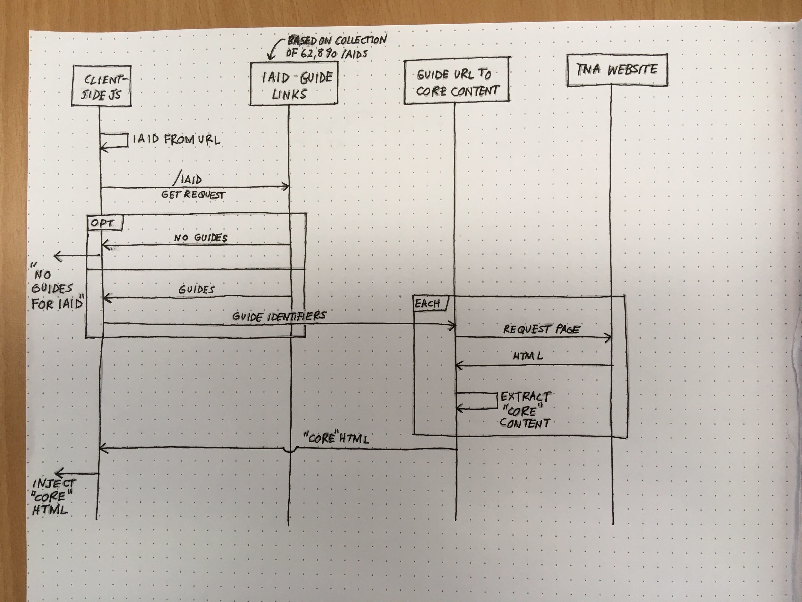

# IAID / Guide links

A quick proof of concept to surface links between items and research guides. This is based on the data Matt has produced.

## Testing 

A basic service is running on [Heroku](https://mighty-island-64939.herokuapp.com). It can be tested in two ways:
 
 1. Visiting a details page in Discovery and pasting the code from [browser_code.js](browser_code.js) the JavaScript console for a modern browser (we'd ensure backward compatibility for production, but this is just a demo)
 2. Visiting `https://mighty-island-64939.herokuapp.com/` directly - the base route displays a list of links.
 
 ## What the JavaScript code is doing
 
 The sequence diagram below shows how the in-browser JavaScript code is using the microservices
 
 
